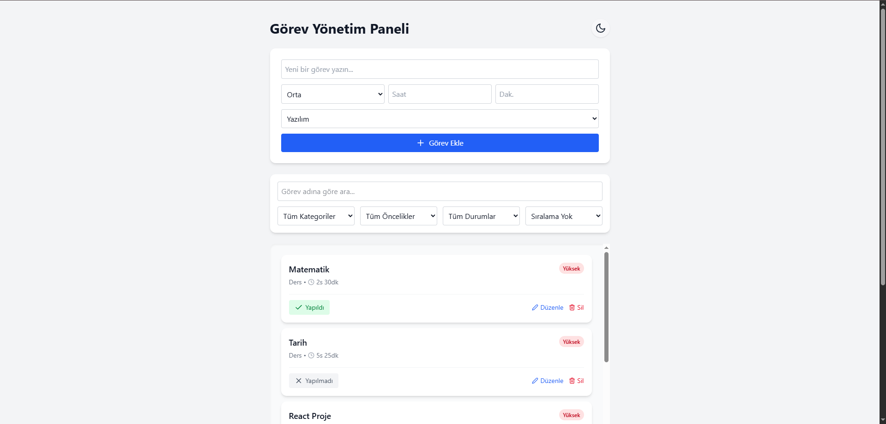
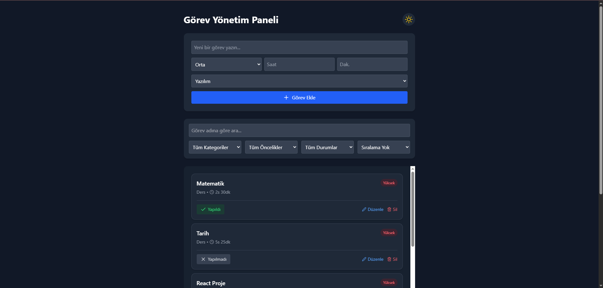
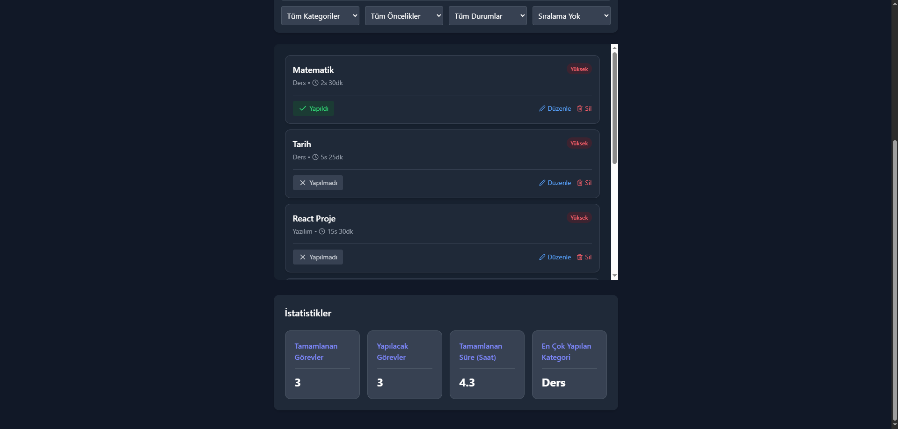

# 📝 Görev Yönetim Paneli (React Todo App)

Bu proje, günlük görevleri takip etmek ve yönetmek için geliştirilmiş modern ve duyarlı (responsive) bir web uygulamasıdır. 

**[Uygulamayı Canlı Olarak İncelemek İçin Tıklayın](https://atakan-todo-app.netlify.app)**

## ✨ Özellikler
* **Karanlık Mod (Dark Mode):** Tek tuşla aydınlık ve karanlık tema arası geçiş.
* **İstatistik Paneli:** Tamamlanan görevler, harcanan süre ve en çok kullanılan kategoriyi gösteren dinamik dashboard.
* **Gelişmiş Filtreleme:** Görevleri öncelik, durum veya kategoriye göre filtreleme ve sıralama.
* **Kalıcı Hafıza:** Veriler tarayıcının yerel hafızasında (Local Storage) tutulur, sayfa yenilense de kaybolmaz.
* **CRUD İşlemleri:** Kullanıcıdan alınan veriler ile basit CRUD işlemleri yapılır.

## 🚀 Kullanılan Teknolojiler
* React (Vite)
* Tailwind CSS v4
* React Icons

## 📸 Ekran Görüntüleri

*Aydınlık Mod Görünümü:*


*Karanlık Mod Görünümü:*


*Liste Altındaki Dashboard Görünümü:*



## Kurulum ve Çalıştırma

### Gereksinimler
* Node.js ve npm

### Adımlar

1. **Projeyi bilgisayarınıza indirin (Klonlayın):**
   ```bash
    git clone [https://github.com/AtakanSoydan/TODO-App.git](https://github.com/AtakanSoydan/TODO-App.git)
    cd TODO-App
   ```

2. **Proje bağımlılıklarını yükleyin:**
   ```bash
   npm install
   ```

3. **Geliştirme sunucusunu başlatın:**
   ```bash
   npm run dev
   ```

Tarayıcınızda http://localhost:5173 adresine giderek projeyi canlı olarak görüntüleyebilir ve geliştirmeye başlayabilirsiniz.